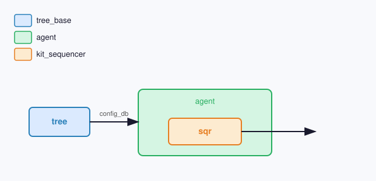

# UVM 组件

## config_db

| 键 | 类型 | 设置时机 | 说明 |
| --- | --- | --- | --- |
| `tree` | **tree_base** | 例化 **agent** 前 | 测试平台创建 **tree**、**build** 绑定寄存器模型、**connect_{name}_tree** 挂 **vif** 后写入；**build_phase** 赋给 **sqr.tree** |

## 快捷函数

在 **agent.sqr** 上调用；**tree** 入参默认空时用 **sqr.tree**。

| 名称 | 入参 | 说明 | 生成条件 |
| --- | --- | --- | --- |
| **config_reg** | **tree** | 按树节点写寄存器 | 配置 **class_regmodel** 且节点绑定了 **regs** |
| **check_freq** | **tree** | 量 **source**、**clk**、**pll** 频率 | 至少一处节点配置 **path** |
| **check_duty** | **tree** | 量带 **vif** 节点占空比 | 至少一处节点配置 **path** |
| **test_freq** | **tree** | **config_reg** 后 **check_freq** | **path** 与 **regs** 均配置 |
| **test_duty** | **tree** | **config_reg** 后 **check_duty** | **path** 与 **regs** 均配置 |
| **test_flip** | **tree** | 分频比翻转探测 | **route_test_enabled** 为真 |
| **test_route** | **tree**、**always_active_clk_nodes** | 结构探测；**always_active_clk_nodes** 为须全程保持活动的 **clk** 队列，默认空则要求全部 **clk** 活动 | **route_test_enabled** 为真 |
