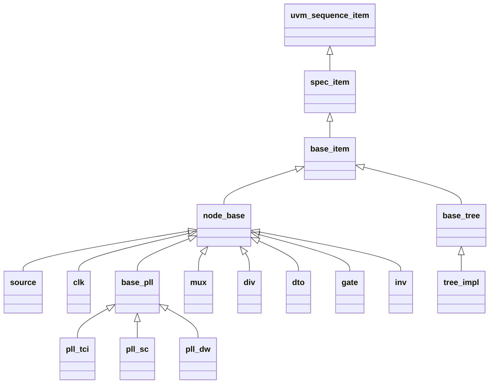

# 数据模型

展开类型名带 **class_prefix** 前缀；下文标题与表仅用后缀名。

## 类型继承

配置中的每棵 **tree** 展开为 **`{name}_tree`** 类型，挂在 **base_tree** 下；节点类型均派生 **node_base**。

**spec_item** 即 **spec** 以 **uvm_sequence_item** 为类型实参的展开名。**tree_impl** 表示各配置树类型，如 **main_tree**。

## node_base

各类时钟树节点的公共字段。

| 成员 | 类型 | 说明 |
| --- | --- | --- |
| kind | string | 器件类型；各派生类在 **new** 中设为配置 **kind** 字面量 |
| allow_bad_duty | bit，rand | 为真时放宽占空比检查；**node_base** 软约束默认为 0，配置为真时 **tree** 软约束为 1 |
| frequence | longint，rand | 典型频率，单位 Hz；**cst_node_base** 软约束默认为 0 |
| valid | bit，rand | 时钟是否有效；**cst_node_base** 软约束默认为 0 |
| vif | virtual interface | 配置中填写 RTL 路径时由 **tree_connection** 绑定对应 interface；未配置则为 null |
| source | 节点句柄 | 前级驱动；无配置则为 null |
| cst_clk_from_src | 约束 | 前级非空时 **valid** 与前级一致；子类可重载 |
| cst_freq_from_src | 约束 | 前级非空时 **frequence** 与前级一致；子类可重载或空关断 |

## base_tree

整棵时钟树的节点容器。

| 成员 | 类型 | 说明 |
| --- | --- | --- |
| nodes | 节点队列 | 建树后装入的全部节点句柄 |
| low_power | bit，rand | 低功耗；软约束默认为 0。**cst_base_tree** 在 **low_power** 为 0 时将 **nodes** 中 **kind** 为 **clk** 的 **valid** 软约束为 1，为 1 时软约束为 0 |

## source

配置 **kind: source** 的时钟根节点；无前级时 **cst_freq_from_src** 不施加频率等式，频率由 **tree** 软约束或随机。**cst_source**：**frequence** 大于 0 时 **valid** 为 1。

## clk

观测用时钟节点；**valid** 可随机，有前级时随 **cst_clk_from_src** 与前级一致。

## base_pll

PLL 公共基类；**kind** 在 **new** 中固定为 **pll**。空关断 **cst_freq_from_src**（输出频率不等于参考时钟，由 **cst_pll** 与 tree 软约束约束输出）；**config_reg** 以 **source.frequence** 为参考时钟算分频，**source** 为 null 则 **uvm_fatal**。**cst_pll**：**frequence** 大于 0 时 **valid** 为 1。

| 成员 | 类型 | 说明 |
| --- | --- | --- |
| pll_kind | pll_kind_e | 各 **pll_*** 子类在 **new** 中赋固定枚举值 |
| locked | bit | 锁定指示 |

YAML **pll_kind** 决定 **tree** 例化 **pll_tci**、**pll_sc**、**pll_dw** 中的哪一类，并与 **regs** 允许键校验一致；展开后 **pll_kind** 成员与之类型一致。

| 配置 pll_kind | 展开类型 | 说明 |
| --- | --- | --- |
| tci | pll_tci | TCI 寄存器在该类 |
| sc | pll_sc | SC 寄存器在该类 |
| dw | pll_dw | DW 寄存器在该类 |

| 配置 / 成员 | 类型 | 说明 |
| --- | --- | --- |
| source | str，必填 | 参考时钟前级节点名；**tree** 构造时写入 **source** 句柄 |
| pll_kind | tci、sc、dw，必填，大小写不限 | 决定例化哪一类 **pll_*** |
| targets | list[str]，必填 | 下游节点名列表 |
| regs | dict，可选 | 键为逻辑名、值为 寄存器模型点分路径，可带 `[n]` 或 `[msb:lsb]` 后缀；**非空时键集合须与 pll_kind 允许表完全一致**，不得缺键或多键 |

| pll_kind | regs 须包含的键 |
| --- | --- |
| tci | lock、bypass、pwrdn、reset、clkod、clkf、clkr、bwadj |
| sc | lock、vocpd、postdivpd、dsmpd、pd、bypass、refdiv、postdiv2、postdiv1、fbdiv |
| dw | lock、fbdiv、prediv、reset、pwron、shift、bypass、divvcor、r、p、divvcop、enr、enp |

## mux

多路选择节点。

| 成员 / 配置 | 类型 | 说明 |
| --- | --- | --- |
| sel | int，rand | 选择值；**source** 非空时 **cst_base** 中 **inside** 与 **source** 键一致 |
| to_source | 关联数组，int 键 | 各输入前级；**post_randomize** 在 **to_source[sel] != null** 时写入 **source** |
| reg | string，可选 | 寄存器模型点分路径，可带比特范围后缀；**config_reg** 写入 **sel** |

**cst_clk_from_src**：**to_source[sel]** 为空则 **valid** 为 0，否则随所选前级 **valid**。

## div

分频节点。

| 成员 / 配置 | 说明 |
| --- | --- |
| ratio | 分频比，rand，须 1～64；1 表示不分频，大于 1 表示分频比为 **ratio** |
| regs | 映射，可选 | 非空时键为 rst、load、div，值为各 field 的 寄存器模型点分路径，可带比特范围后缀 |

**cst_div**：**ratio** 在 1～64；**cst_freq_from_src** 为前级频率整除 **ratio**。

**config_reg**：**rst** 写 0；**div** 写 N，N=0 不分频，N>0 时分频比为 N+1；**load** 先写 0 再写 1。

## dto

占空比变换节点。

| 成员 / 配置 | 说明 |
| --- | --- |
| ratio | 分频比，rand，须大于 0 且不超过 2^25；与 **step** 对应关系为 分频比 = 2^25 / **step** |
| regs | 可选；非空时键须为 **rstn**、**load**、**bypass**、**step**，值为各 field 的 寄存器模型点分路径，可带比特范围后缀 |

**cst_freq_from_src**：前级频率整除 **ratio**。

**config_reg** 写入：**rstn**=0，**load**=1，**bypass**=0，**step**=2^25/**ratio**（整数，须落在 1～2^25−1，故 **ratio** 不能为 1）。

## gate

门控节点。

| 成员 / 配置 | 类型 | 说明 |
| --- | --- | --- |
| open | bit，rand | 为真时开放时钟通行；为假时屏蔽输出 |
| reg | string，可选 | 寄存器模型点分路径，可带比特范围后缀；**config_reg** 写入 **open** |

重载 **cst_clk_from_src**：前级有效且 **open** 为真时 **valid** 为真。

## inv

反相器节点；除 **node_base** 公共字段外无附加成员。
