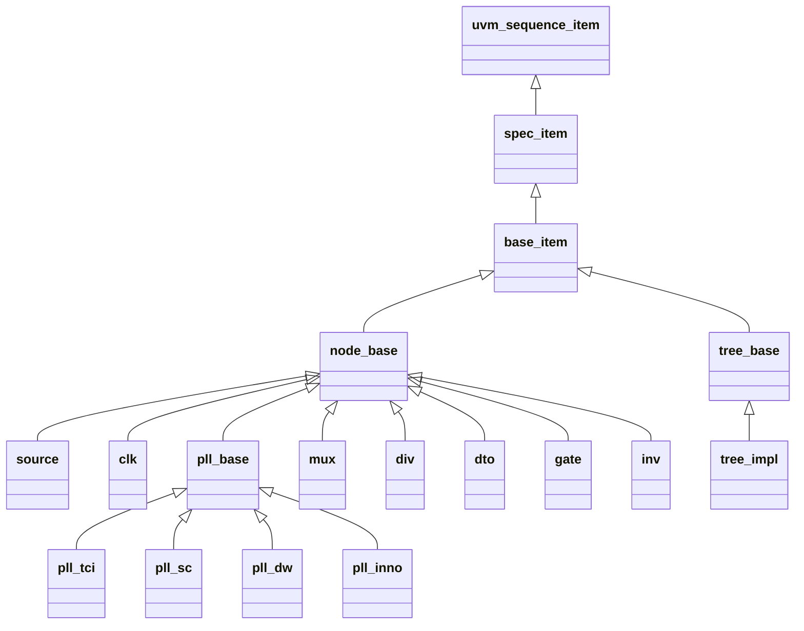

# 数据模型

展开类型名带 **class_prefix** 前缀；标题与表格只写类型名后缀。

## 类型继承

每棵时钟树对应一个 **{name}_tree** 类型，派生自 **tree_base**。节点类型均派生自 **node_base**。

**spec_item** 是 **spec** 以 **uvm_sequence_item** 为类型实参后的类型名。**tree_impl** 表示各配置树类型，如 **main_tree**。

## node_base

各类时钟树节点的公共字段。

| 成员 | 类型 | 说明 |
| --- | --- | --- |
| **kind** | **string** | 器件类型 |
| **frequence** | **longint**，**rand** | 典型频率，单位 Hz |
| **valid** | **bit**，**rand** | 时钟有效状态 |
| **vif** | **virtual interface** | 测量接口句柄 |
| **source** | **node_base** | 当前选中的前级节点 |

| 约束 | 说明 |
| --- | --- |
| **cst_node_base** | **frequence** 与 **valid** 默认软约束为 0 |
| **cst_resolve_active_from_src** | 前级非空时 **valid** 与前级一致 |
| **cst_resolve_freq_from_src** | 前级非空时 **frequence** 与前级一致 |

## tree_base

整棵时钟树的节点容器。

| 成员 | 类型 | 说明 |
| --- | --- | --- |
| **nodes** | **node_base** 队列 | 建树后的全部节点句柄 |
| **low_power** | **bit**，**rand** | 为 0 时 **clk** 节点默认有效；为 1 时 **clk** 节点默认无效 |

## 图遍历

**tree_nodes** 工具函数接收 **tree_base** 与节点句柄，结果不含入参节点本身。**mux** 按全部 **to_source** 输入计算，不只看当前 **sel**。

| 函数 | 说明 |
| --- | --- |
| **get_nodes_before** | 沿 **source** / **to_source** 收集全部前级节点 |
| **get_nodes_after** | 收集以该节点为前级的全部后级节点 |
| **get_tree_head_nodes** | 收集整棵树的开端节点 |
| **get_tree_tail_nodes** | 收集整棵树的末尾节点 |
| **get_subgraph_tail_nodes** | 在入参节点队列内筛选末尾节点 |
| **filter_nodes_by_kind** | 按 **kind** 筛选节点队列；空串不过滤 |
| **get_sources_before** / **get_clks_before** / **get_plls_before** | 固定 **kind** 的前级筛选函数 |
| **get_sources_at_tree_head** / **get_clks_at_tree_tail** | 整棵树开端或末尾的固定 **kind** 筛选函数 |

## source

时钟根节点。

| 成员 | 类型 | 说明 |
| --- | --- | --- |
| **classic_frequence** | **longint** | 配置中的典型频率 |

| 约束 | 说明 |
| --- | --- |
| **cst_source** | **frequence** 等于 **classic_frequence**；频率大于 0 时 **valid** 为 1 |
| **cst_resolve_freq_from_src** | 无前级时不施加频率等式 |

## clk

测量用时钟节点。

| 成员 | 类型 | 说明 |
| --- | --- | --- |
| **frequence** | **longint** | 频率，单位 Hz |
| **enabled** | **bit**，**rand** | 活动状态 |
| **unfix_frequence** | **bit** | 为 1 时 **frequence** 不受解析频率约束 |
| **unfix_enabled** | **bit** | 为 1 时 **enabled** 不受解析有效状态约束 |

| 约束 | 说明 |
| --- | --- |
| **cst_clk** | **frequence** 与 **enabled** 默认绑定到解析结果 |

## pll_base

PLL 公共基类。目标输出频率由 **frequence** 给定，参考频率来自 **source**。

| 成员 | 类型 | 说明 |
| --- | --- | --- |
| **classic_frequence** | **longint** | 配置中的目标频率 |
| **pll_kind** | **pll_kind_e** | PLL 型号枚举 |
| **locked** | **bit** | 锁定状态 |

| 约束 | 说明 |
| --- | --- |
| **cst_pll** | **frequence** 等于目标频率；频率大于 0 时 **valid** 为 1 |
| **cst_resolve_freq_from_src** | 空关断；PLL 输出频率不直接沿前级传递 |

### pll_tci

| 成员 | 类型 | 说明 |
| --- | --- | --- |
| **f_lock** | 寄存器 field | lock 状态 |
| **f_bypass** | 寄存器 field | bypass 开关 |
| **f_pwrdn** | 寄存器 field | 掉电控制 |
| **f_reset** | 寄存器 field | 复位控制 |
| **f_clkod** | 寄存器 field | 输出分频系数 |
| **f_clkf** | 寄存器 field | 反馈倍频系数 |
| **f_clkr** | 寄存器 field | 参考分频系数 |
| **f_bwadj** | 寄存器 field | 环路带宽调节 |

### pll_sc

| 成员 | 类型 | 说明 |
| --- | --- | --- |
| **f_lock** | 寄存器 field | lock 状态 |
| **f_vocpd** | 寄存器 field | VCO 掉电 |
| **f_postdivpd** | 寄存器 field | 后级分频掉电 |
| **f_dsmpd** | 寄存器 field | ΔΣ 调制掉电 |
| **f_pd** | 寄存器 field | 掉电控制 |
| **f_bypass** | 寄存器 field | bypass 开关 |
| **f_refdiv** | 寄存器 field | 参考分频系数 |
| **f_postdiv2** | 寄存器 field | 后级分频 2 系数 |
| **f_postdiv1** | 寄存器 field | 后级分频 1 系数 |
| **f_fbdiv** | 寄存器 field | 反馈分频系数 |

### pll_dw

| 成员 | 类型 | 说明 |
| --- | --- | --- |
| **f_lock** | 寄存器 field | lock 状态 |
| **f_fbdiv** | 寄存器 field | 反馈分频系数 |
| **f_prediv** | 寄存器 field | 前级分频系数 |
| **f_reset** | 寄存器 field | 复位控制 |
| **f_pwron** | 寄存器 field | 上电控制 |
| **f_shift** | 寄存器 field | 频点偏移 |
| **f_bypass** | 寄存器 field | bypass 开关 |
| **f_divvcor** | 寄存器 field | VCO 分频系数 |
| **f_r** | 寄存器 field | R 分频系数 |
| **f_p** | 寄存器 field | P 分频系数 |
| **f_divvcop** | 寄存器 field | VCO 后级分频系数 |
| **f_enr** | 寄存器 field | R 通道使能 |
| **f_enp** | 寄存器 field | P 通道使能 |

### pll_inno

| 成员 | 类型 | 说明 |
| --- | --- | --- |
| **group_id** | **int** | 输出路序号 |
| **f_lock** | 寄存器 field | lock 状态 |
| **f_pd** | 寄存器 field | 掉电控制 |
| **f_refdiv** | 寄存器 field | 参考分频系数 |
| **f_fbdiv** | 寄存器 field | 反馈分频系数 |
| **f_postdiv1** | 寄存器 field | 本路后级分频 1 系数 |
| **f_postdiv2** | 寄存器 field | 本路后级分频 2 系数 |

## mux

多路选择节点。

| 成员 | 类型 | 说明 |
| --- | --- | --- |
| **sel** | **int**，**rand** | 当前选择值 |
| **max_sel** | **int** | 最大选择值 |
| **fix_sel** | **int** | 非负时固定 **sel** |
| **to_source** | **node_base** 关联数组 | 各输入前级 |
| **f_reg** | 寄存器 field | 选择 field |

| 约束或回调 | 说明 |
| --- | --- |
| **cst_mux** | **sel** 在 0 至 **max_sel** 内 |
| **cst_resolve_active_from_src** | 当前输入为空时 **valid** 为 0，否则跟随当前输入 |
| **post_randomize** | 将 **source** 指向 **to_source[sel]** |

## div

整数分频节点。

| 成员 | 类型 | 说明 |
| --- | --- | --- |
| **ratio** | **int**，**rand** | 分频比，1～64 |
| **fix_ratio** | **int** | 大于 0 时固定 **ratio** |
| **f_rst** | 寄存器 field | 复位位 |
| **f_load** | 寄存器 field | 加载位 |
| **f_div** | 寄存器 field | 分频系数 |

| 约束 | 说明 |
| --- | --- |
| **cst_div** | **ratio** 在 1～64 |
| **cst_resolve_freq_from_src** | 输出频率为前级频率整除 **ratio** |

## dto

小数分频节点。

| 成员 | 类型 | 说明 |
| --- | --- | --- |
| **ratio** | **int**，**rand** | 分频比，大于 0 且不超过 2^25 |
| **fix_ratio** | **int** | 大于 0 时固定 **ratio** |
| **f_rst** | 寄存器 field | 复位位 |
| **f_load** | 寄存器 field | 加载位 |
| **f_bypass** | 寄存器 field | bypass 位 |
| **f_step** | 寄存器 field | 步进控制 |

| 约束 | 说明 |
| --- | --- |
| **cst_dto** | **ratio** 大于 0 且不超过 2^25 |
| **cst_resolve_freq_from_src** | 输出频率为前级频率整除 **ratio** |

## gate

门控节点。

| 成员 | 类型 | 说明 |
| --- | --- | --- |
| **open** | **bit**，**rand** | 时钟通行状态 |
| **fix_open** | **bit** | 为 1 时固定 **open** 为 1 |
| **fix_close** | **bit** | 为 1 时固定 **open** 为 0 |
| **f_reg** | 寄存器 field | 门控位 |

| 约束 | 说明 |
| --- | --- |
| **cst_gate** | **fix_open** 与 **fix_close** 控制 **open** |
| **cst_resolve_active_from_src** | **open** 为真且前级有效时 **valid** 为 1 |
| **cst_resolve_freq_from_src** | **open** 为真且前级存在时 **frequence** 跟随前级，否则为 0 |

## inv

反相器节点。除 **node_base** 公共字段外无附加成员。
