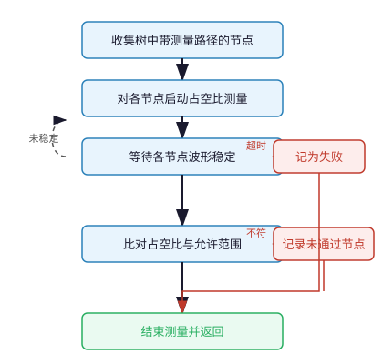

# check_duty

检查占空比

## req

| 成员 | 类型 | 说明 |
| --- | --- | --- |
| **tree** | **tree_base** | 时钟树 |
| **quiet** | **bit** | 减少 **UVM** 日志 |

## 流程

## rsp

| 成员 | 类型 | 说明 |
| --- | --- | --- |
| **ok** | **bit** | 全部节点通过 |
| **failed_nodes** | **node_base** 队列 | 占空比未通过节点 |
