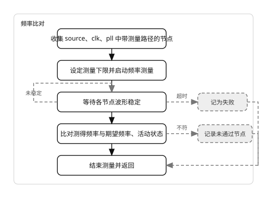

# check_measure

同时检查频率与占空比；interface 一次 **start_measure** 并行观测。先经 **active_cycles** 个上升沿确认有活动，再各自独立计数稳定周期。

## req

| 成员 | 类型 | 说明 |
| --- | --- | --- |
| **tree** | **tree_base** | 时钟树 |
| **quiet** | **bit** | 静默打印 |
| **check_freq** | **bit** | 为真时检查 **source**、**clk**、**pll** 频率 |
| **check_duty** | **bit** | 为真时检查全部带 **vif** 节点占空比 |
| **min_freq_hz** | **int** | 允许最低时钟频率；0 则用 **settings.min_freq_hz** |

## 流程

## rsp

| 成员 | 类型 | 说明 |
| --- | --- | --- |
| **ok** | **bit** | 全部节点通过 |
| **failed_nodes** | **node_base** 队列 | 占空比未通过节点 |
