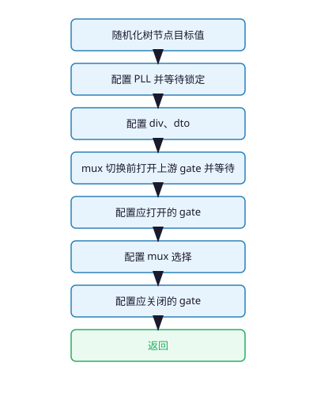

# config_reg

写寄存器

## req

| 成员 | 说明 |
| --- | --- |
| **tree** | 时钟树 |
| **quiet** | 为真时减少 **UVM** 日志 |

## 流程

### 随机化树节点目标值

- 随机化树上各节点目标频率与控制量。

### 配置 PLL 并等待锁定

- 节点不活动、缺前级、频率非法、寄存器未绑全、与上次相同 → 跳过。
- 本轮写过寄存器的 **pll** 排队等待锁定；**pll_inno** 同组只由 **group_id** 为 0 的那路等待锁定，超时失败，成功后记为已锁定。
- 需复位或掉电的 **pll** 分两次写，同父寄存器内可合并的 field 一次写完。
  - **tci**：先拉复位 → 保持复位写旁路与分频 → 释复位并关 bypass
  - **sc**：先五路掉电与 bypass → 再写分频系数
  - **dw**：先复位 → 写上电与移位相关位 → 延时后释复位并关 shift
  - **inno**：先掉电 → 再写 **pd**=0 与 **refdiv**/**fbdiv**；**group_id** 0 写组内共用分频与后级分频，其余 **group_id** 只写后级分频

### 配置 div、dto

- 需复位的 **div** / **dto**：先只写复位位，再写取消复位与其余 field。
- **div**：已写过寄存器的只更新分频比与 **load** 脉冲；或每次完整复位两步。
- **dto**：已写过寄存器的只更新 **step**、**load** 与 **bypass**；或每次完整复位两步。

### mux 切换前打开上游 gate 并等待

- 仅 **sel** 将变化的 **mux**；上游 **gate** 全部打开。
- 按最慢直接前级时钟，固定周期数等待，多路取最长。

### 配置应打开的 gate

- 只写目标为打开的 **gate**。

### 配置 mux 选择

- **sel** 未变则跳过；否则写入选择寄存器。

### 配置应关闭的 gate

- 只写目标为关闭的 **gate**。

## rsp

| 成员 | 说明 |
| --- | --- |
| **ok** | 无错误时为真 |
