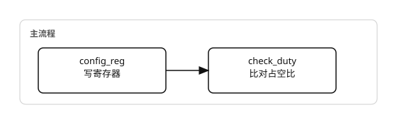

# test_duty

测试占空比

## req

| 成员 | 类型 | 说明 |
| --- | --- | --- |
| **tree** | **tree_base** | 时钟树 |
| **quiet** | **bit** | 静默打印 |

## 流程

## rsp

| 成员 | 类型 | 说明 |
| --- | --- | --- |
| **ok** | **bit** | 子步骤全部通过 |
