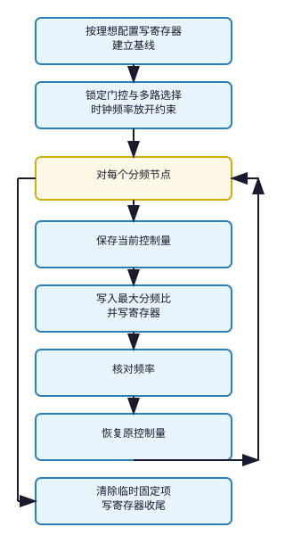

# test_flip

- 固定 **gate** / **mux**，对每个已绑 **reg** 的 **div** / **dto** 各测两种 **field** 单比特 pattern：**MSB**=1、**LSB**=0 与 **MSB**=0、**LSB**=1；单比特 pattern 非法时保留该探测位，再 OR **bit[1]** 等低位辅助比特使其合法，例如 **LSB** 单独为 1 时结果为 3；**config_reg** 后 **check_freq**
- 同时存在带 **path** 与带 **reg** 的节点，且 **class_regmodel** 非空

## req

| 成员 | 类型 | 说明 |
| --- | --- | --- |
| **tree** | **tree_base** | 时钟树 |
| **quiet** | **bit** | 减少 **UVM** 日志 |

## 主流程

## rsp

| 成员 | 类型 | 说明 |
| --- | --- | --- |
| **ok** | **bit** | 全部探测对象通过 |
