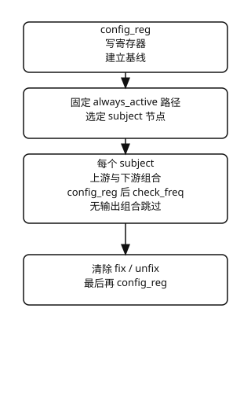

# test_route

- 对每个 **subject** 遍历上下游：**subject** 状态变体 × 连线节点组合，每组合 **config_reg** 后 **check_freq**
- 同时存在带 **path** 与带 **reg** 的节点，且 **class_regmodel** 非空
- 配置宜：**div** / **dto** 分频比为 1；各 **PLL** 目标频率互异且不同于晶振

## req

| 成员 | 类型 | 说明 |
| --- | --- | --- |
| **tree** | **tree_base** | 时钟树 |
| **always_active_clk_nodes** | **node_base** 队列 | 每轮都要活动的 **clk**；空队列表示全部 **clk** |
| **quiet** | **bit** | 减少 **UVM** 日志 |

## 主流程

| 节点 | 自身变体 |
| --- | --- |
| **gate** | 开、关 |
| **mux** | 各 **sel** |
| **div** | 分频比 1、2 |
| **dto** | 分频比 1、2 |

## rsp

| 成员 | 类型 | 说明 |
| --- | --- | --- |
| **ok** | **bit** | 全部未跳过组合通过 |
