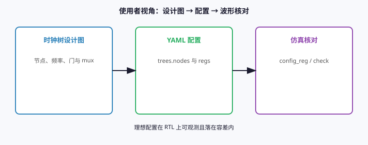
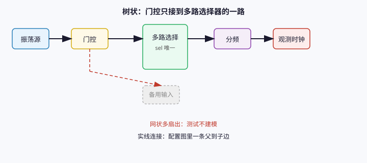
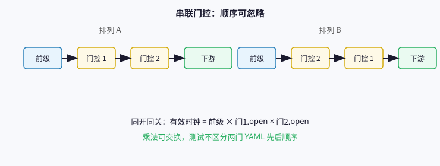
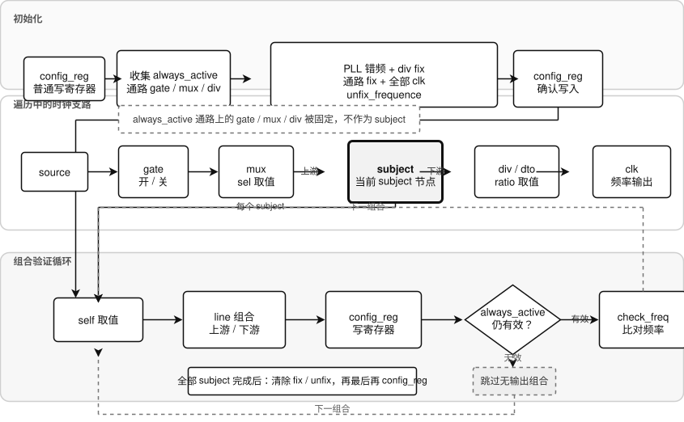

# 测试方法与正确性论证

时钟树 **agent** 的验证目标：使用者能照着芯片时钟树设计图，把 **YAML** 配成与图一致的理想状态，并在 RTL 仿真里用波形与寄存器写读结果确认。本文记录验证前提、每个 **test** 序列的理论与具体步骤，以及在这些前提下的正确性理由。

## 文档与代码同步

| 情况 | 须同步更新 **test.md** |
| --- | --- |
| 修改 `sequence/test/<名>/` 下 **test** 序列的**测试逻辑**、分波规则、调用的 **operation** 组合或 **req** / **rsp** 语义 | **当轮**改对应 **test** 专节：理论、具体方法、**错误点与允许点分析**、判定表 |
| 仅修实现 bug、日志措辞、变量命名，**不改变**上述语义 | 可不改正文 |
| 新增 `sequence/test/<名>/` 目录 | 在一览表加一行，并写完整专节：理论、具体方法、**错误点与允许点分析** 等 |
| 删除某个 **test** | 删掉专节与一览表行 |

真源是 `sequence/test/<名>/test.sv.j2` 与 **kit_sequencer** 上同名 **task**；**test.md** 给人读论证，不得长期落后于代码。

## 论证前提

### 使用者视角

测试站在**使用者**角度，而不是 RTL 微结构审计。使用者手里有时钟树设计图，需要回答的是：**按图填写节点名、前级关系、目标频率、门开闭、mux 选择、PLL 型号与寄存器路径之后，芯片行为是否与设计意图一致**。

因此下列差异**不纳入**测试目标，也不单独造用例：

+ 两个 **gate** 串联且必定同开同关时，物理上谁先谁后不影响**时钟是否通过**；有效通行条件是两个 **open** 的乘积，乘法可交换。配置里两门的先后顺序、**config_reg** 里关门控的相对次序，不改变使用者能配出的理想集合。
+ 反相器 **inv** 只改变相位，不改变频率与门控语义；频率检查只覆盖 **source**、**clk**、**pll**。
+ 寄存器镜像里未建模的保留位、与节点语义无关的只读位，不写不测。

框名对照：

+ **时钟树设计图**：SoC 文档里的拓扑与目标频率
+ **YAML 配置**：`trees.nodes` 与 `settings`
+ **仿真核对**：**config_reg**、**check_freq**、**check_duty** 等 operation

### 树状拓扑

配置中的每棵 **tree** 是**有向树**：每个节点至多一个被选中的前级 **source**；**mux** 的多个输入在配置里是 **to_source** 表，但**实际连通下游**时只选一路，**sel** 与 **to_source[sel]** 唯一确定前级。

推论：

+ 对某一 **gate** 而言，若设计图上它只接到某个 **mux** 的其中一路输入，要连通该 **mux** 下游，**mux.sel** 在理想配置中是**唯一**的，不存在**同一 gate 同时驱动两条互斥下游路径**的网状歧义。

框名对照：

+ **实线连接**：允许的配置边，父节点写入子节点 **source** 或 **mux.to_source**
+ **虚线连接**：网状多扇出，当前 **agent** 与测试集不建模

## 测试分层

| 层级 | 目录 | 职责 |
| --- | --- | --- |
| operation | `sequence/operation/<名>/` | 单一可观测动作：写寄存器、测频、测占空比 |
| test | `sequence/test/<名>/` | 组合多个 operation，覆盖使用者常见场景 |

测试平台在 **kit_sequencer** 上调用 **task**；**test** 与 **operation** 序列的 **p_sequencer** 类型为基础 **sequencer**，在 **body** 里 **start** 子序列。

## test 序列一览

至少一处节点配置 **path** 时，下列文件才会生成并进入 **all.f**。

| 名称 | 目录 | **kit** **task** | **req** 要点 | **rsp** 要点 |
| --- | --- | --- | --- | --- |
| **test_freq** | `sequence/test/test_freq/` | **test_freq**；**tree** 默认空则用 **kit** 上 **tree** | **tree** 句柄，可空；**quiet** 为 1 时不打进度 **uvm_info** | **ok** 汇总 |
| **test_duty** | `sequence/test/test_duty/` | **test_duty**；**tree** 默认空则用 **kit** 上 **tree** | 同 **test_freq** | **ok** 汇总 |
| **test_flip** | `sequence/test/test_flip/` | **test_flip**；**tree** 默认空则用 **kit** 上 **tree** | 同 **test_freq** | **ok** 汇总 |
| **test_route** | `sequence/test/test_route/` | **test_route**；**tree** 默认空则用 **kit** 上 **tree**；**always_active_clk_nodes** 为须全程保持活动的 **clk** 句柄队列，默认空 | **tree** 句柄，可空；**always_active_clk_nodes** 为须全程保持活动的 **clk** 节点队列，空则要求全部 **clk** 活动；**quiet** 为 1 时不打进度 **uvm_info** | **ok** 汇总 |

## test_route

**生成条件**：**enable_node_fix**、**regs_enabled**、**any_node_path** 均为真。

### 理论

使用者按设计图配好时钟树后，除频率与占空比外，还须确认各可调节点在树中的**前后级关系**正确：错误配置可能表现为器件不工作、节点挂到错误分支，或同一条串联线上门控与分频顺序与图不一致但对观测频率无影响。

在**树状拓扑**前提下，验证某一节点位置时，应先把**所有门控打开**、**所有下游多路选择**选通穿过该节点的支路，使下游时钟有效。再以**该节点自身视角**只看穿过它的支路，分别核对上游与下游结构：对侧方向上的多路选择与门控单独切换，若一条线上有多个此类节点则做排列组合；观测频率或关断变化即可反证结构。各节点局部结构均正确时，整棵树的前后级关系有唯一解。

为使多路选择切换后频率可区分，调用前环境宜令各 **div**、**dto** 分频比为 1，各 **PLL** 在 YAML 中配置不同 **frequence**，且与晶振频率不同；基线 **fix_***、**config_reg**、**check_freq** 由测试平台在 **test_route** 之前完成。

### 具体方法

**结构探测**：全部 **clk** 的 **unfix_frequence** 为 1；**unfix_enabled** 为 0 仅当该 **clk** 在 **always_active_clk_nodes** 中，或 **always_active_clk_nodes** 为空时作用于全部 **clk**。作为必启 **clk** 前级的 **gate**、**mux** 不作为 **subject** 探测。对其余已绑寄存器的 **gate**、**mux**、**div**、**dto** 节点，分别做**上游**与**下游**探测：

1. 用 **get_nodes_before** / **get_nodes_after** 收集该节点在对应方向上的 **gate**、**mux**、**div**、**dto** 线列表，不含自身。
2. 遍历**自身**可选状态：门控开与关、多路选择各 **sel**、分频比 1 与 2；探测时暂时放开 **fix_***，结束后恢复。
3. 对每个自身状态，对线上其它节点做排列组合，**config_reg** 整树、**quiet** 为 1，再 **check_freq** 全树；**always_active_clk_nodes** 非空且当前组合会使所列 **clk** 失活时跳过该组合，不 **check_freq**；其余失败则 **fatal**。
4. 该方向完成后从已存控制量快照恢复并写回寄存器，再测下一节点。

核心辅助函数在 **core/route_structure.sv**。

### 控制台进度

**quiet** 为 0 时，**uvm_info** 按结构探测与细目分行输出，便于对照仿真时间轴：

| 阶段 | 内容 |
| --- | --- |
| 开头 | **tree** 名字、**always_active_clk_nodes** 名单或「全部 **clk** 须活动」 |
| 探测 | 过滤必启 **clk** 通路上的 **gate** / **mux** **subject**；对其余 **subject** 分别打 **upstream** / **downstream**、线上节点、自身变体与线组合、**check_freq** 或跳过原因；段末汇总运行与跳过次数 |
| 结尾 | 清除全部 **clk** **unfix_frequence** 与 **unfix_enabled**、恢复控制量、**config_reg**、通过汇总 |

探测循环内 **config_reg** 恒 **quiet** 为 1，避免与上层进度行重复；收尾 **config_reg** 跟随 **req.quiet**。

### 错误点与允许点分析

#### 须检出的错误点

| 错误点 | 使用者可见现象 | 覆盖方式 |
| --- | --- | --- |
| 上下游结构错误 | 切换线节点后频率与模型不一致 | **check_freq** 失败 → **fatal** |
| 寄存器未写入 | **config_reg** 失败 | **fatal** |

#### 允许点

| 允许点 | 含义或配置 | 测试行为 |
| --- | --- | --- |
| 串联门控顺序 | 同开同关的门控先后不影响频率 | 不单独验证顺序；线上组合只改变开闭与分频、**sel** |
| 非必启时钟关断 | **always_active_clk_nodes** 未列入的 **clk** 可被门控或 **mux** 关断 | 跳过会使必启 **clk** 失活的组合 |
| 必启通路上的门控与多路选择 | 改变该 **gate** / **mux** 可能关断必启 **clk** | 不作为 **subject** 探测 |
| 反相器 | 只改相位 | 不在线列表中，不参与组合 |

#### 本 test 范围外

| 错误点 | 应由谁覆盖 |
| --- | --- |
| 占空比 | **check_duty** **operation** |
| 网状重汇 | 论证前提外 |

### 依赖的 operation

| operation | 在本 **test** 中的角色 |
| --- | --- |
| **config_reg** | 每次对整棵 **tree** 写寄存器；**pll** 等未变配置可跳过重复写 |
| **check_freq** | 每次探测后核对 **source**、**clk**、**pll** 频率 |

### 判定与失败

| 条件 | 行为 |
| --- | --- |
| **tree** 为空 | **fatal** |
| **config_reg** 内 **randomize** 失败 | **fatal** |
| 无带寄存器的 **gate** / **mux** / **div** / **dto** | **fatal** |
| 任一步 **check_freq** 或 **config_reg** 失败 | **fatal** |

### 正确性

在各支路频率可区分且调用前基线度量已通过的前提下：对每个节点的上游、下游分别用可控寄存器扰动线节点，若模型前后级与 RTL 一致，则 **check_freq** 应与当前 **open**、**sel**、**ratio** 传播后的 **_resolved_freq** 一致；局部均通过则各节点前后级与配置图一致。

## 常用 operation 摘要

**test** 序列组合下列 **operation**；字段与超时见 **settings** 与各 **operation** 的 **req**。

| operation | 作用 | 与 **test** 关系 |
| --- | --- | --- |
| **config_reg** | 五段写寄存器：**pll** → **div** / **dto** → 开 **gate** → **mux** → 关 **gate** | 单独写寄存器；**test_freq**、**test_duty**、**test_flip** 开头调用；**test_route** 在探测循环与收尾调用 |
| **check_freq** | 量 **source** / **clk** / **pll** 频率对 **frequence** | **test_freq**、**test_route**、**test_flip** 内部组合 |
| **check_duty** | 量占空比对 **duty_min** / **duty_max** | **test_duty** 组合 |

**config_reg** 写寄存器前对 **tree** 执行 **randomize**，软约束覆盖使用者按图可能填写的合法组合；分别存在 **path** 节点与 **reg** 或 **regs** 节点时模型生成 **fix_*** 成员，固定场景由序列或环境在 **config_reg** 调用前对 **fix_open**、**fix_sel**、**fix_ratio** 等赋值，YAML 不提供对应字段。

## 正确性论证

### 前提到目标的映射

| 前提 | 测试如何保证 |
| --- | --- |
| 使用者按设计图配置 | **YAML** 建树；**config_reg** 内 **randomize** 后写 **open**、**sel**、分频 |
| 忽略串联门控顺序 | **config_reg** 两段 **gate** 不改变 **open** 乘积语义 |
| 树状、**mux.sel** 在合法范围 | **cst_mux** 与 **max_sel** |
| 频率正确 | **check_freq** 与 **div** / **dto** / **pll** 换算及约束同源 |
| 占空比 | **check_duty** 对带 **vif** 节点一次批量测量 |

### 充分性边界

在**上述前提**内，端到端充分检查建议包含：

1. **test_freq** 或 **test_duty** 开头的 **config_reg** 覆盖所有带 **regs** / **reg** 的 **pll**、**div**、**dto**、**gate**、**mux**。
2. **test_freq** 覆盖 **source**、**clk**、**pll** 观测点。
3. **test_duty** 覆盖所有带 **path** 的 **vif** 节点。

**不声称**覆盖：网状时钟、异步跨时钟域、门控物理差异导致的占空比畸变、未配置 **path** 的节点。

### 失败即使用者可见错误

**operation** 与 **test** 在度量失败、PLL 超时、寄存器路径非法时 **uvm_error** 或 **fatal**；**check_duty** 经 **rsp.ok** 汇总。这与使用者**配错了或 RTL 不符合图**的判定一致，而不是仅检查序列是否跑完。

## 建议用例形状

| 场景 | 配置要点 | 调用 |
| --- | --- | --- |
| 单树端到端 | `example.yaml` 各 **kind** 至少一个，部分节点带 **path**、部分节点带 **reg** 或 **regs** | **test_freq** → **test_duty** |
| 通路结构 | 同上；**gate**、**mux**、**div**、**dto** 等分别配置 **path** 与寄存器，不必同一节点 | **test_freq** 通过后 **test_route** |
| 仅 PLL 路径 | **pll** + **source**，**regs** 齐全 | **test_freq** 只看 **pll** |
| 门控全关 | 多个 **gate** 串联，**open** 随机 | **test_freq** 在关断分支 **valid** 为 0 处不测或期望无时钟 |
| 固定 mux | 节点 **path** + **reg**，**fix_sel** | **test_freq** 前 **sel** 不变，只应看到选定前级频率 |
| 固定 div 分频 | 节点 **path** + **regs**；**test_freq** 前设 **fix_ratio** | **ratio** 不变，**test_freq** 按该分频比换算 |

长时随机回归可在环境中循环调用 **test_freq**，或先 **config_reg** 再 **check_freq**。
