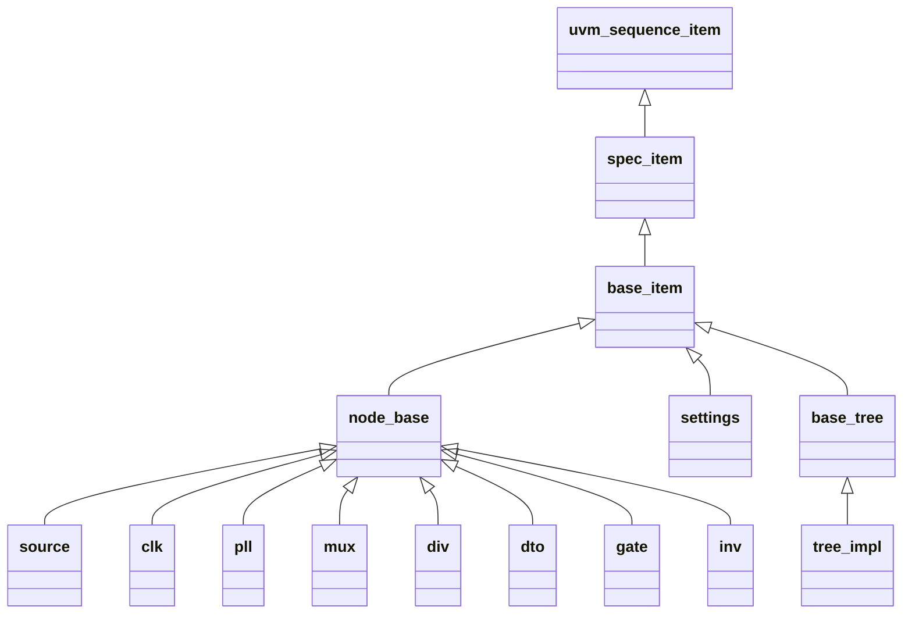

# 数据模型

展开类型名带 **class_prefix** 前缀；下文标题与表仅用后缀名。

## 类型继承

配置中的每棵 **tree** 展开为 **`{name}_tree`** 类型，挂在 **base_tree** 下；节点类型均派生 **node_base**。

**spec_item** 即 **spec** 以 **uvm_sequence_item** 为类型实参的展开名。**tree_impl** 表示各配置树类型，如 **main_tree**。

## pll_kind_e

| 取值 | 说明 |
| --- | --- |
| PLL_TCI | PLL 型号 |
| PLL_SC | PLL 型号 |
| PLL_DW | PLL 型号 |

## node_base

各类时钟树节点的公共字段。

| 成员 | 类型 | 说明 |
| --- | --- | --- |
| kind | string | 器件类型；各派生类在 **new** 中设为配置 **kind** 字面量 |
| path | string | DUT 信号层次路径；留空则不例化 interface，**vif** 为 null |
| allow_bad_duty | bit | 为真时放宽占空比检查 |
| frequence | longint | 典型频率，单位 Hz，rand |
| valid | bit，rand | 当前节点时钟是否有效；无前级时由子类约束 |
| vif | virtual interface | **path** 非空时由 **connection** 绑定对应 interface |
| source | 节点句柄 | 前级驱动；无配置则为 null |
| cst_clk_from_src | 约束 | 前级非空时 **valid** 与前级一致；子类可重载 |
| cst_freq_from_src | 约束 | 前级非空时 **frequence** 与前级一致；子类可重载或空关断 |

## source

配置 **kind: source** 的时钟根节点；空关断 **cst_freq_from_src**，频率由 **tree** 软约束或随机。

## clk

观测用时钟节点；**valid** 可随机，有前级时随 **cst_clk_from_src** 与前级一致。

## pll

PLL 节点；空关断 **cst_freq_from_src**，频率由 **tree** 软约束指向配置典型值。

| 成员 / 配置 | 类型 | 说明 |
| --- | --- | --- |
| pll_kind | pll_kind_e | PLL 型号 |
| locked | bit | 锁定指示 |
| regs | 映射，可选 | 键须落在该 **pll_kind** 允许集合内；路径写法同 **div** |

| pll_kind | 允许 regs 键 |
| --- | --- |
| PLL_TCI | lock、bypass、ndiv、fdiv、pd |
| PLL_SC | lock、en、mult |
| PLL_DW | lock、pwdn、m、n、od |

## mux

多路选择节点。

| 成员 | 类型 | 说明 |
| --- | --- | --- |
| sel | int | 选择值 |
| to_source | 关联数组，int 键 | 各输入前级；**post_randomize** 按 **sel** 写入 **source** |

## div

分频节点。

| 成员 / 配置 | 说明 |
| --- | --- |
| div_ratio | 分频比，默认 1，须大于 0 |
| regs | 可选；逻辑名 **ratio**、**enable**、**bypass** 对应 **uvm_reg_field**；值为自 RAL 根起的点分路径，或一层 block 名下挂 field 短名 |

**cst_div**：**div_ratio** 须大于 0；重载 **cst_freq_from_src**，前级频率整除 **div_ratio**。

## dto

占空比变换节点。

| 成员 / 配置 | 说明 |
| --- | --- |
| div_ratio | 分频比，默认 1，须大于 0 |
| regs | 可选；逻辑名 **ratio**、**duty**、**enable**、**bypass**；路径写法同 **div** |

频率约束同 **div**。

## gate

门控节点。

| 成员 / 配置 | 类型 | 说明 |
| --- | --- | --- |
| gate | bit | 门控开关 |
| reg_gate | string，可选 | 门控 field 点分路径；省略表示无寄存器 |

重载 **cst_clk_from_src**：前级有效且 **gate** 为真时 **valid** 为真。

## inv

反相器节点。

| 成员 | 类型 | 说明 |
| --- | --- | --- |
| inv | bit | 反相使能 |
